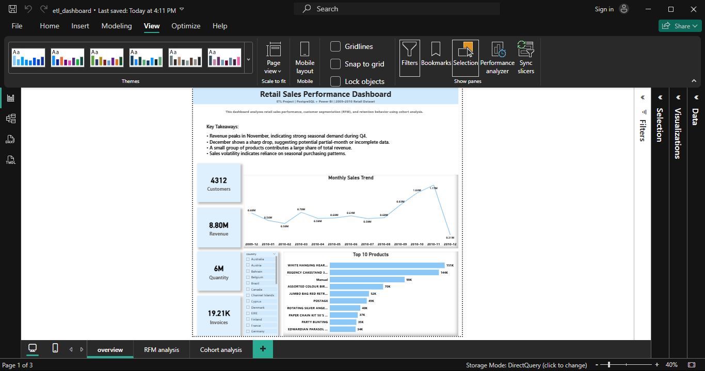
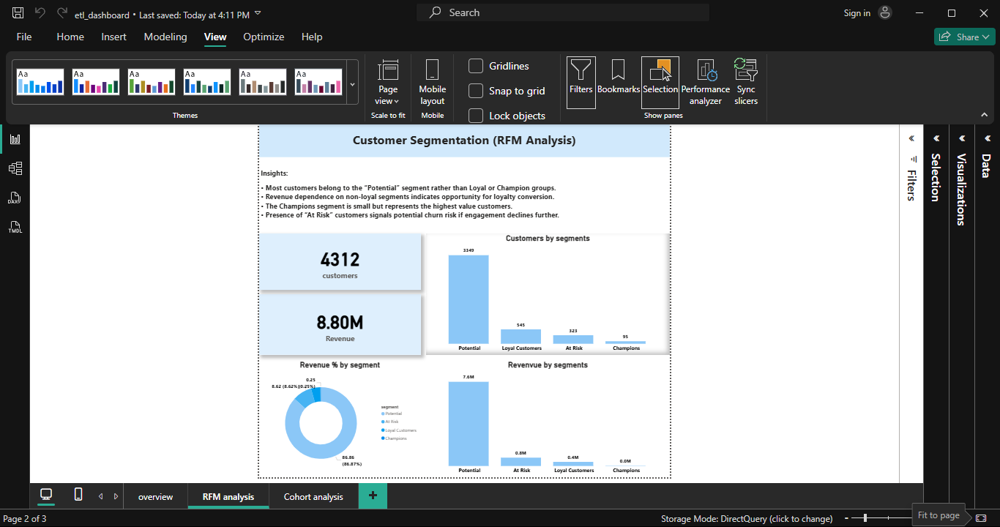
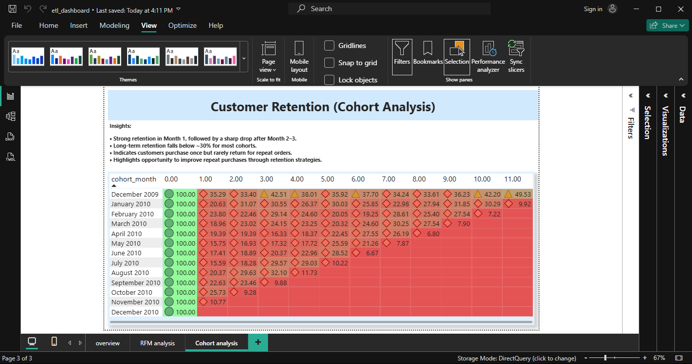

# 📊 Retail Sales Customer Analytics  
### End-to-End ETL + SQL + Power BI Business Intelligence Project

---

## 🚀 Project Overview

This project presents a complete end-to-end retail analytics solution built using **Python (ETL), SQL (business analysis), and Power BI (visualization)**.

The objective was to transform raw transactional data into meaningful business insights that help identify revenue patterns, customer behavior trends, retention gaps, and growth opportunities.

The project demonstrates structured data processing, analytical thinking, and business-oriented insight generation.

---

## 🛠 Tools & Technologies

- **Python** – Data cleaning and ETL processing  
- **SQL (PostgreSQL/MySQL)** – Analytical queries and business logic  
- **Power BI** – Interactive dashboards and data storytelling  
- **Dataset** – Online Retail transactional dataset  

---

## 📈 Key Business Questions Addressed

- Why does revenue fluctuate across months?
- Which customer segments contribute most to revenue?
- How strong is customer retention over time?
- Is the company dependent on seasonal demand?
- Are revenues concentrated in a few products?

---

## 🔍 Key Insights Discovered

### 1️⃣ Seasonal Revenue Dependency
- Revenue peaks significantly during **November (Q4)**.
- A sharp decline follows in December.
- Indicates strong seasonal dependency in overall sales performance.

**Business Impact:**  
The company relies heavily on Q4 revenue cycles, making long-term revenue stability vulnerable to seasonal fluctuations.

---

### 2️⃣ RFM Customer Segmentation Opportunity
- Majority of customers fall into the **"Potential"** segment.
- Loyal and Champion segments are comparatively smaller.
- Revenue is not strongly anchored in repeat high-value customers.

**Business Impact:**  
Converting just **10% of Potential customers into Loyal customers** could significantly increase repeat purchase revenue and improve long-term stability.

---

### 3️⃣ Cohort Retention Decline
- Strong retention observed in Month 1.
- Significant drop-off after Month 2–3.
- Long-term retention falls below ~30% for most cohorts.

**Business Impact:**  
Improving Month 3 retention from 30% to 40% represents a **33% relative improvement**, directly enhancing Customer Lifetime Value (CLV).

---

### 4️⃣ Revenue Concentration Risk
- A small number of products contribute disproportionately to total revenue.
- Indicates dependency risk on limited SKUs.

**Business Impact:**  
Diversifying product performance can reduce revenue volatility and improve business resilience.

---

## 💡 Business Value Delivered

This project enables data-driven decision-making by:

- Identifying customer lifecycle drop-off points  
- Quantifying retention improvement opportunities  
- Highlighting seasonal revenue volatility  
- Detecting revenue concentration risks  
- Supporting loyalty and engagement strategy planning  

---

## 📊 Dashboard Highlights

| Overview | RFM Segmentation | Cohort Retention |
|----------|-----------------|-----------------|
|  |  |  |

---

## 📦 How to Run This Project

1. Load dataset into PostgreSQL  
2. Run SQL queries in `ETL_PROJECT_RETAIL_ANALYSIS.sql`  
3. Clean and preprocess using `script/extract.py`  
4. Open the Power BI file in the `powerbi/` folder  
5. Explore dashboards and insights  

---

## 🧠 Skills Demonstrated

- ETL Pipeline Development  
- SQL Aggregation & Analytical Queries  
- Window Functions  
- RFM Segmentation Modeling  
- Cohort Retention Analysis  
- Data Storytelling  
- Dashboard Design  
- Business Insight Communication  

---

## 🎯 Conclusion

This project showcases the ability to transform raw transactional data into structured analytical insights. It reflects real-world Data Analyst responsibilities, combining technical implementation with business-oriented thinking to support strategic decision-making.

---

### 👤 Developed by: Geethesh Kumar R
